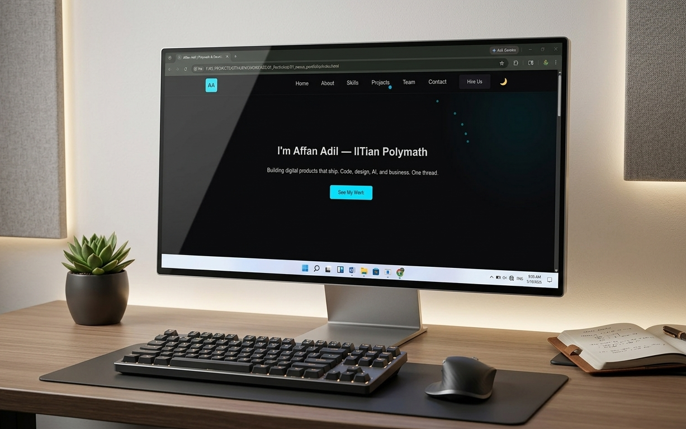
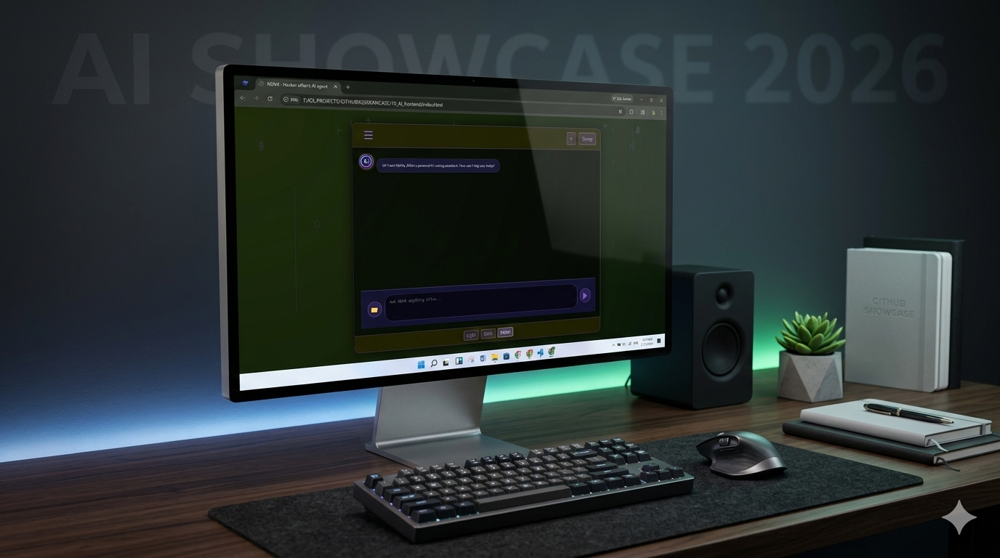
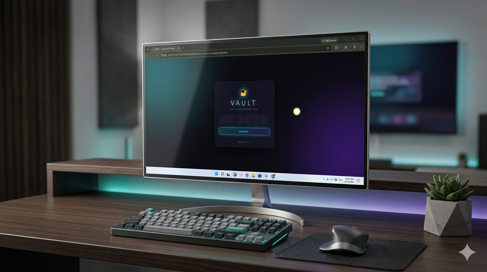
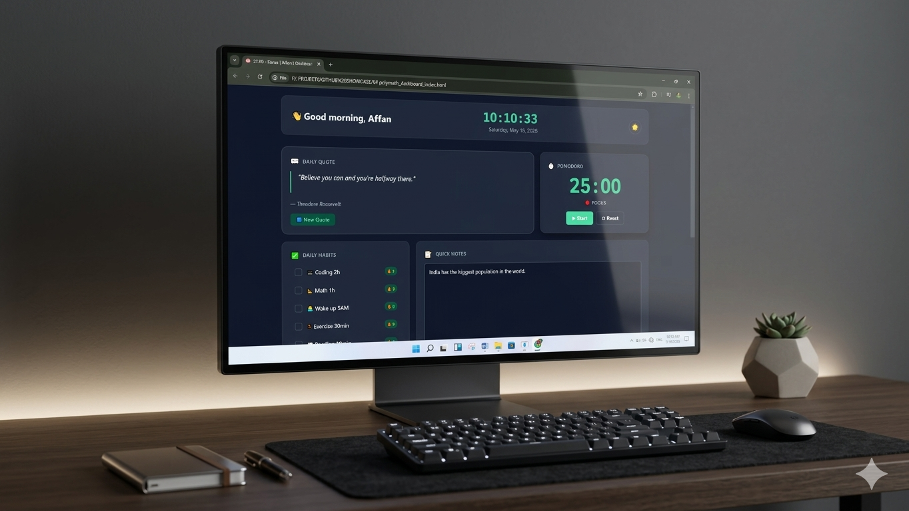
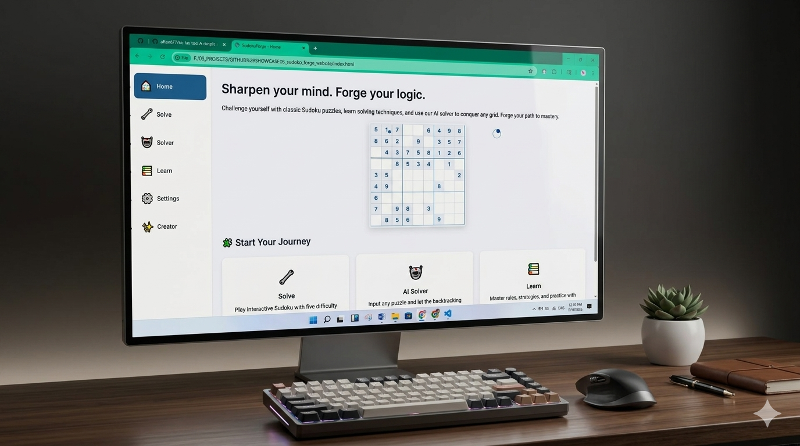

<div align="center">


# 👋 Hi, I'm Affan Adil

**Future Full Stack Developer | AI Enthusiast | Problem Solver**

*Building intelligent solutions, one line of code at a time.*

</div>

---

## 💡 About Me

I'm a passionate developer with a love for **web development** and **artificial intelligence**. I enjoy solving complex problems, building innovative projects, and continuously learning new technologies. My mission is to become a world-class developer and create meaningful impact in the tech ecosystem.

- 🔭 Currently working on **Web Development & AI Projects**
- 🌱 Learning **JavaScript, Python, AI tools, and Full-Stack development**
- 💡 Passionate about **coding, startups, and innovation**
- 🎯 Goal: **Create intelligent, scalable solutions that solve real-world problems**

---

## 🛠️ Tech Stack & Skills

### 💻 Programming Languages


### ⚙️ Tools & Platforms


---


---

## ⏳ Coding Activity (Last 7 days)

<!--START_SECTION:waka-->


**🐱 My GitHub Data** 

> 📦 124.9 kB Used in GitHub's Storage 
 > 
> 🏆 325 Contributions in the Year 2026
 > 
> 🚫 Not Opted to Hire
 > 
> 📜 103 Public Repositories 
 > 
> 🔑 0 Private Repositories 
 > 
**I'm an Early 🐤** 

```text
🌞 Morning                130 commits         █████████████░░░░░░░░░░░░   52.63 % 
🌆 Daytime                117 commits         ████████████░░░░░░░░░░░░░   47.37 % 
🌃 Evening                0 commits           ░░░░░░░░░░░░░░░░░░░░░░░░░   00.00 % 
🌙 Night                  0 commits           ░░░░░░░░░░░░░░░░░░░░░░░░░   00.00 % 
```
📅 **I'm Most Productive on Tuesday** 

```text
Monday                   22 commits          ██░░░░░░░░░░░░░░░░░░░░░░░   08.91 % 
Tuesday                  76 commits          ████████░░░░░░░░░░░░░░░░░   30.77 % 
Wednesday                37 commits          ████░░░░░░░░░░░░░░░░░░░░░   14.98 % 
Thursday                 31 commits          ███░░░░░░░░░░░░░░░░░░░░░░   12.55 % 
Friday                   34 commits          ███░░░░░░░░░░░░░░░░░░░░░░   13.77 % 
Saturday                 25 commits          ███░░░░░░░░░░░░░░░░░░░░░░   10.12 % 
Sunday                   22 commits          ██░░░░░░░░░░░░░░░░░░░░░░░   08.91 % 
```


📊 **This Week I Spent My Time On** 

```text
💬 Programming Languages: 
No Activity Tracked This Week

🔥 Editors: 
No Activity Tracked This Week

💻 Operating System: 
No Activity Tracked This Week
```

🤖 **AI Coding This Week** 

```text
No AI Coding Activity Tracked This Week
```

**I Mostly Code in JavaScript** 

```text
JavaScript               34 repos            ████████░░░░░░░░░░░░░░░░░   34.00 % 
HTML                     30 repos            ████████░░░░░░░░░░░░░░░░░   30.00 % 
CSS                      22 repos            ██████░░░░░░░░░░░░░░░░░░░   22.00 % 
Python                   12 repos            ███░░░░░░░░░░░░░░░░░░░░░░   12.00 % 
TypeScript               2 repos             ░░░░░░░░░░░░░░░░░░░░░░░░░   02.00 % 
```


 Last Updated on 19/08/2026 19:05:05 UTC
<!--END_SECTION:waka-->

---

## ✍️ Latest Blog Posts

<!-- BLOG-POST-LIST:START -->
*Working on some new articles! Stay tuned.*
<!-- BLOG-POST-LIST:END -->

---

## 🚀 Featured Projects

| Project | Description |
|---------|-------------|
| **01_nexus_portfolio** | Personal portfolio website showcase |
| **10_ai_frontend** | AI-powered frontend application |
| **06_model_matrix_ai** | Advanced AI model framework |
| **04_polymath_dashboard** | Interactive dashboard application |
| **05_sudoku_forge_website** | Sudoku puzzle solver & generator |
| **02_password_manager** | Secure password management tool |
| **03_bookmark_manager** | Smart bookmark organization system |
| **07_super_trust_website** | Trust & security-focused platform |
| **dreambridge_school** | Educational platform project |
| **eco_green_bottles** | Sustainability-focused initiative |
| **tic-tac-toe** | Classic game implementation |

---

## 📸 Project Showcase

<div align="center">

### Portfolio & Frontend Projects


*Nexus Portfolio - Professional Portfolio Website*


*AI Frontend - Intelligent User Interface*

### Utility & Productivity Tools


*Password Manager - Secure Credential Storage*


*Bookmark Manager - Smart Organization*

### Advanced Projects


*Model Matrix AI - AI Framework*


*Polymath Dashboard - Data Visualization*

### Specialized Applications


*Sudoku Forge - Puzzle Solving Application*


*Super Trust - Security Platform*

</div>

---

## 🔥 Contribution Activity

<div align="center">

[](https://github.com/affan675)

</div>

---

## 🎲 Daily Dev & Motivation

> **Random Dev Joke**: <!-- JOKE_START -->"Why don't scientists trust atoms? Because they make up everything!"<!-- JOKE_END -->
>
> **Motivational Quote**: <!-- QUOTE_START -->"The only way to do great work is to love what you do." — Steve Jobs<!-- QUOTE_END -->

*Last dynamic update: <!-- DATE_START -->2024-06-05 04:54 UTC<!-- DATE_END -->*

---

## 🌐 Let's Connect

<div align="center">

[](https://github.com/affan675)
[](mailto:affanadil119@gmail.com)

</div>

---

## 💭 Philosophy

> **"Code is not just instructions — it's the creation of intelligence. Every line we write shapes the future of technology."**

---

<div align="center">

### ⭐ Thanks for visiting my profile!

*Feel free to explore my repositories and connect with me for collaboration, opportunities, or just a chat about tech!*

---

*Last updated: <!-- FOOTER_DATE_START -->2024-06-05 04:54 UTC<!-- FOOTER_DATE_END -->*

</div>